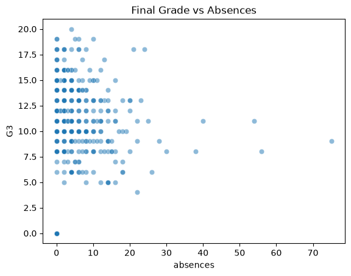

## Session 15: Attendance, Past Failures, and Final Grade
### Variables Examined
- `failures`: number of past class failures
- `absences`: number of school absences
- `studytime`: weekly study-time category
- `G3`: final grade
### Past Failures and Final Grade
The mean final grade generally decreased as the number of past failures increased.
- Mean G3 for 0 failures: 11.25
- Mean G3 for 1 failure: 8.12
- Mean G3 for 2 failures: 6.23

GSSRP 2026 - Kean University | Predicting Student Performance Using Machine Learning Session 15/48 - Week 2
- Mean G3 for 3 or more failures: [ENTER VALUE]
This result indicates that past failures are negatively associated with final
grade. Students with more previous failures generally had lower final grades. This
is an association and should not be interpreted as proof that previous failures
directly cause lower current grades.
### Absences and Final Grade
The scatterplot showed the relationship between the number of absences and final
grade. The overall pattern was [weak/moderate/strong] and [negative/positive].
Students with higher absence counts generally tended to have [lower/higher] final
grades, although substantial variation and overlap were visible.
Correlation between absences and G3: [ENTER VALUE]
The variation in the scatterplot indicates that absences should not be used alone
to predict student performance.
### Ranked Features
The variables were ranked by apparent predictive strength as follows:
1. [ENTER FIRST FEATURE]
2. [ENTER SECOND FEATURE]
3. [ENTER THIRD FEATURE]
The ranking was based on correlations, grouped means, visual patterns, group sizes,
and overlap.
### Early-Warning Interpretation
Past failures can be used as a baseline risk indicator because the information is
available before or at the beginning of the term. Absences can be monitored during
the term as a dynamic warning signal. Study time may provide additional context but
may depend on self-reported information.
These variables should be combined with other appropriate predictors rather than
used independently.
### Figure
